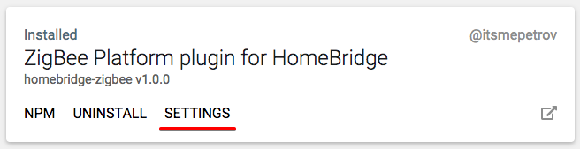

# Plugin Configuration

## Minimum configuration

```json
{
  "bridge": {
    "name": "Homebridge",
    "username": "CC:22:3D:E3:CE:30",
    "port": 51826,
    "pin": "031-45-154"
  },
  "description": "My homebridge configuration",
  "platforms": [
    {
      "platform": "ZigBeePlatform"
    }
  ]
}
```

## Available options

The following configuration options are available:

| Name                  | Default     | Description                                                                                                                                                |
|-----------------------|-------------|------------------------------------------------------------------------------------------------------------------------------------------------------------|
| port                  | `undefined` | Port for USB stick (_example_: `/dev/tty.usbmodem144`). If not set, it tries to find port automatically.                                                   |
| panId                 | `0xFFFF`    | Identify the ZigBee PAN-ID. This id should be a value between 0 and 0x3FFF. You can also set it to 0xFFFF to let ZigBee choose a random PAN-ID on its own. |
| channel               | `11`        | Channel for your ZigBee dongle (11-25).                                                                                                                    |
| database              | `undefined` | Path to zigbee database. If not set, it uses '<homebridge_storage_path>/zigbee.db' path.                                                                   |
| permitJoinTimeout     | `120`       | Timeout of permit join command (seconds).                                                                                                                  |
| routerPollingInterval | `60`        | Router polling intervall, some routers need polling to prevent them from sleeping (seconds).                                                               |
| disableLed            | `false`     | Turn off the stick led indicator.                                                                                                                          |
| disablePingLog        | `false`     | Disable ping records in log.                                                                                                                               |

## Extra

### homebridge-config-ui-x

It can be configured via [homebridge-config-ui-x](https://www.npmjs.com/package/homebridge-config-ui-x) plugin.


